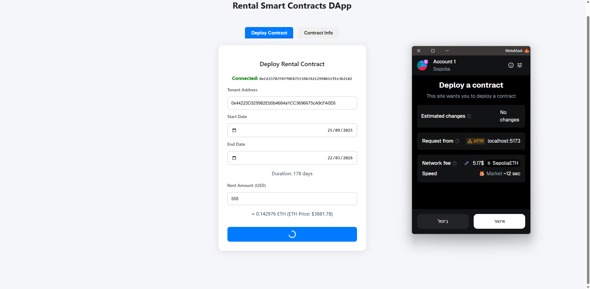
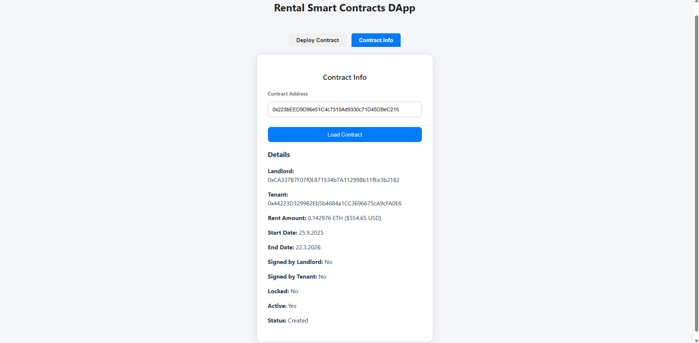

# Rental Smart Contracts DApp 

Frontend decentralized application (dApp) for interacting with the [Rental-Smart-Contracts](https://github.com/TomerBitonn/Rental-Smart-Contracts.git) repository.  
This dApp allows landlords and tenants to easily **deploy, view, and interact with rental agreements on-chain**.

---

## 📖 Overview

This project is the **React-based frontend** for the Rental Smart Contracts system.  
The backend logic (smart contracts) is located in the [`Rental-Smart-Contracts`](https://github.com/TomerBitonn/Rental-Smart-Contracts.git) repository.

The dApp provides a **user-friendly interface** for:
- Deploying new rental contracts on Ethereum.
- Viewing contract details (landlord, tenant, rent amount, dates, status).
- Tracking payments.
- Performing contract actions (sign, lock, update rent, pay, cancel, terminate).

---

## 🚀 Features

✅ **Deploy Contract**  
- Connect your MetaMask wallet.  
- Enter tenant address, rental price in USD, and start/end dates.  
- The dApp converts USD → ETH automatically.  
- Deploys the contract to Sepolia Testnet.  

✅ **Contract Info**  
- Load a deployed contract by entering its address.  
- View detailed contract information:
  - Landlord, tenant.
  - Rent amount (ETH + USD).
  - Start & end date.
  - Contract status (Created, Signed, Locked, Cancelled, Terminated).
- Track all payments made.  

✅ **Future actions (In Progress)**  
- Sign contract (landlord/tenant).  
- Lock contract.  
- Update rent.  
- Pay rent.  
- Cancel or terminate contract.  

---

## 🛠️ Tech Stack

- [React](https://reactjs.org/) - Frontend library.  
- [Ethers.js](https://docs.ethers.io/) - Ethereum interactions.  
- [MetaMask](https://metamask.io/) - Wallet connection.  
- [CoinGecko API](https://www.coingecko.com/) - Fetch ETH/USD price.  
- [Sepolia Testnet](https://sepolia.etherscan.io/) - Deployment network.  

---

## 📂 Project Structure

```
Rental-dApp
│
├── assets/
│   ├── Contract_Info.png
│   └── Deploy_Rental_Contract.png
│
├── node_modules/
│
├── src/
│   ├── abi/ 
│   │   └── RentalContract.json
│   │
│   ├── components/
│   │   ├── DeployContract.jsx 
│   │   ├── ContractInfo.jsx 
│   │   └── # (Future) contract actions (sign, pay, cancel...)
│   │
│   ├── styles/
│   │   ├── App.css
│   │   ├── Components.css
│   │   └── index.css
│   │
│   ├── App.jsx        # Main app with tab navigation
│   └── main.jsx       # Entry point
│
├── .gitignore
├── eslint.config.js
├── index.html
├── package-lock.json
├── package.json
├── README.md
└── vite.config.js
```

---

## ⚙️ Installation & Setup

1. Clone this repo:
   ```bash
   git clone https://github.com/TomerBitonn/Rental-dApp.git
   cd Rental-dApp
   ```

2. Install dependencies:
   ```bash
   npm install
   ```

3. Start development server:
   ```bash
   npm run dev
   ```

4. Open in browser:
   ```bash
   http://localhost:5173
   ```

---

## 🖼️ Screenshots

### Deploy form


### Contract Info page


---

## 📌 TODO / Next Steps

- Add Sign Contract (landlord & tenant).
- Add Lock/Cancel/Terminate actions.
- Add Pay Rent flow directly from the UI.
- Improve payment history table with better formatting.
