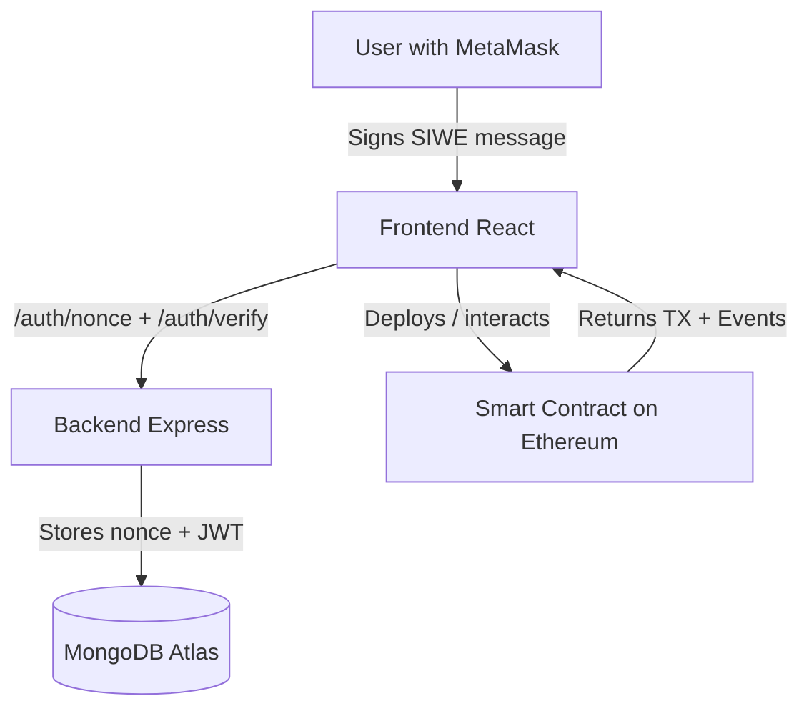
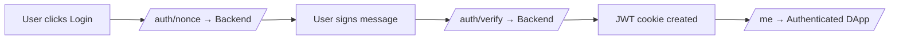

# Rental Smart Contracts DApp 

Full-stack decentralized application (dApp) for **deploying and managing on-chain rental agreements**.  

**Important:**  
This repository contains **only the dApp layer** - the **React frontend** and **Node.js backend** that interact with the blockchain.  
The actual **smart contracts** (Solidity code) are located in a separate repository:  
[Rental-Smart-Contracts](https://github.com/TomerBitonn/Rental-Smart-Contracts.git)

---

## 📖 Overview

This dApp allows **landlords and tenants** to easily interact with Ethereum-based rental contracts.

It integrates with the [Rental-Smart-Contracts](https://github.com/TomerBitonn/Rental-Smart-Contracts.git) repository, the smart contract layer - and provides a complete **frontend + backend system** for authentication and interaction.

---

## ⚙️ Key Features

### 🧩 Authentication (Backend + Frontend)
✅ **Sign-In With Ethereum (SIWE)**  
- Login with MetaMask by signing a message.  
- Secure authentication using EIP-4361 standard.  
- Session stored via **JWT (cookie)** on the backend.  
- MongoDB stores each user’s wallet address and nonce.  
- Automatic nonce rotation after successful login.  

✅ **Logout & Session Management**  
- JWT cleared from browser cookies.  
- `/me` endpoint verifies existing sessions automatically.  

---

### 💡 Smart Contract Interaction (Frontend)

✅ **Deploy Contract**  
- Connect MetaMask wallet.  
- Enter tenant address, rent amount (USD), and rental period.  
- USD automatically converted to ETH.  
- Deploys contract to **Sepolia Testnet**.

✅ **Contract Info**  
- View existing rental contract by address.  
- Displays:
  - Landlord & tenant addresses.  
  - Rent amount (ETH/USD).  
  - Start & end dates.  
  - Contract status (Created / Signed / Locked / Cancelled / Terminated).  
- Tracks payments & on-chain events.  

✅ **Sign Contract**  
- Users can now **sign the rental contract directly from the dApp**.  
- Detects if the connected wallet is the **landlord or tenant**.  
- Automatically calls the correct smart contract function.  
- Updates the contract status live after signature confirmation.

---

## 🏗️ Architecture Overview

This project follows a **modular full-stack architecture**:

- **Frontend (React + Ethers.js)**  
  Handles wallet connection, user interaction, and blockchain transactions.  
  Communicates with the backend using REST endpoints for authentication and data persistence.

- **Backend (Node.js + Express)**  
  Manages authentication (SIWE + JWT), user sessions, and nonces.  
  Serves as a secure bridge between the blockchain and MongoDB.

- **Database (MongoDB Atlas)**  
  Stores user sessions, addresses, and nonces.  
  Ensures one wallet = one user = one rotating nonce.

- **Blockchain Layer (Ethereum / Sepolia)**  
  All rental agreements are deployed and executed on-chain.  
  The smart contracts live in the [Rental-Smart-Contracts](https://github.com/TomerBitonn/Rental-Smart-Contracts.git) repository.

---

## 🔄 System Overview


## 🔐 Authentication Flow Diagram


---

## 🛠️ Tech Stack

| Layer          | Tools                                           |
|----------------|-------------------------------------------------|                                                    
| **Frontend**   | React, Vite, Ethers.js, SIWE.js, MetaMask       |
| **Backend**    | Node.js, Express.js, MongoDB, JWT, CORS, dotenv |
| **Database**   | MongoDB Atlas                                   |
| **Blockchain** | Ethereum (Sepolia Testnet)                      |
| **APIs**       | CoinGecko API (ETH/USD pricing)                 |

---

## 📂 Project Structure

```
Rental-dApp/
│
├── frontend/                      # React-based dApp UI
│   ├── src/
│   │   ├── api.js                 # REST API calls to backend
│   │   ├── App.jsx                # Main app: manages login + tabs
│   │   ├── main.jsx               # Entry point (renders App)
│   │
│   │   ├── components/
│   │   │   ├── Login.jsx          # SIWE login with MetaMask
│   │   │   ├── DeployContract.jsx # Deploy new rental contracts
│   │   │   ├── ContractInfo.jsx   # View contract details
│   │   │   └── SignContract.jsx   # Sign contract on-chain
│   │
│   │   ├── styles/
│   │   │   ├── App.css
│   │   │   ├── Components.css
│   │   │   └── index.css
│   │
│   │   └── abi/
│   │       └── RentalContract.json # ABI of the rental contract
│   │
│   ├── vite.config.js
│   ├── index.html
│   ├── package.json
│   └── README.md
│
└── server/                        # Node.js backend
    ├── server.js                  # Express server (SIWE, JWT, routes)
    ├── db.js                      # MongoDB connection (singleton)
    ├── auth.js                    # Nonce, JWT, SIWE logic
    ├── package.json
    └── .env    
```

---

## 🔐 Security Practices

- JWT tokens are stored in **HttpOnly cookies** (not accessible via JS).  
- Nonce values are rotated after each successful SIWE verification.  
- MongoDB enforces a **unique index** on wallet addresses.  
- CORS restricted to `FRONTEND_ORIGIN` for API protection.  
- No private keys or sensitive wallet data are stored on the backend.

---

## ⚙️ Environment Variables

Your `.env` file (in `/server`) should include:
```bash
PORT=3001
DOMAIN=localhost
FRONTEND_ORIGIN=http://localhost:5173
MONGODB_URI=mongodb+srv://<your-cluster-url>/
JWT_SECRET=your_secret_key
NODE_ENV=development
```

## 🧩 Installation & Run

1. Clone this repo:
   ```bash
   git clone https://github.com/TomerBitonn/Rental-dApp.git
   cd Rental-dApp
   ```

2. Install dependencies:
   ```bash
   cd frontend && npm install
   cd ../server && npm install
   ```

3. Run backend:
   ```bash
   node server.js
   ```

4. Run frontend:
   ```bash
   cd ../frontend
   npm run dev
   ```

5. Open in browser:
   ```bash
   http://localhost:5173
   ```

---

## 🖼️ Screenshots (More to come..)

### Deploy form


### Contract Info page


---

## 🧠 Troubleshooting

- **Error: "Domain does not match provided domain"**  
  → Ensure `.env` → `DOMAIN` matches your frontend URL (e.g. `localhost:5173`).

- **Error: "Invalid nonce"**  
  → Clear browser cookies or restart the backend server to reset sessions.

- **MongoDB connection issues**  
  → Check that your IP is whitelisted in MongoDB Atlas.

- **Metamask not detected**  
  → Make sure the extension is installed and you’re connected to Sepolia.

---

## 📌 TODO / Next Steps

- ✅ Add Sign Contract functionality (done)
- 🔄 Add Lock / Cancel / Terminate contract actions
- 💸 Add Pay Rent flow from the UI
- 🧾 Improve payment history and event tracking
- 🧪 Add unit tests for backend endpoints
