# Rental dApp - Full-Stack Decentralized Rental Management

A complete Web3 DApp for deploying and managing Ethereum-based rental contracts -
including authentication, payments, and lifecycle management (sign, lock, pay, terminate). 

**Important:**  
This repository contains **only the dApp layer** - the **React frontend** and **Node.js backend** that interact with the blockchain.  
The actual **smart contracts** (Solidity code) are located in a separate repository:  
[Rental-Smart-Contracts](https://github.com/TomerBitonn/Rental-Smart-Contracts.git)

---

## 📖 Overview

This dApp allows **landlords and tenants** to easily interact with Ethereum-based rental contracts.

It integrates with the [Rental-Smart-Contracts](https://github.com/TomerBitonn/Rental-Smart-Contracts.git) repository, the smart contract layer - and provides a complete **frontend + backend system** for authentication and interaction.

---

## ⚙️ Key Features

### Home Page
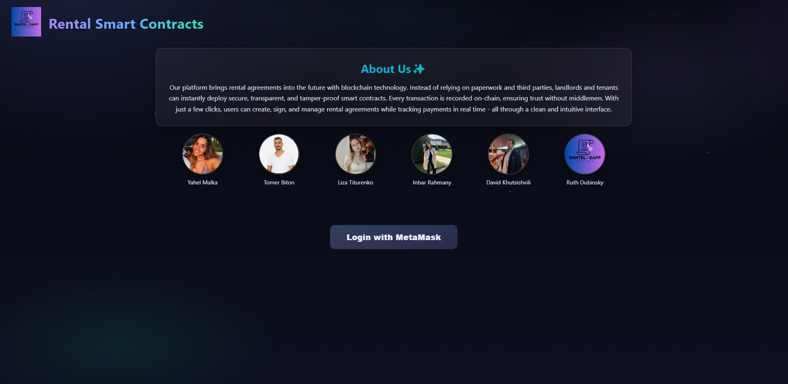

### Login with MetaMask
- Login with MetaMask using Sign-In With Ethereum (EIP-4361)
- Backend verifies wallet signature, issues JWT cookie session
- MongoDB stores wallet addresses and rotating nonces
- Automatic session validation (/me endpoint)
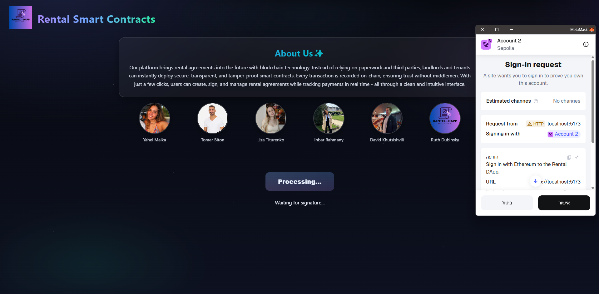

### Deploy Contract
Deploy new rental contracts directly from the dApp - specify:
- Tenant address
- Rent amount (USD → ETH auto conversion via CoinGecko API)
- Start/end dates
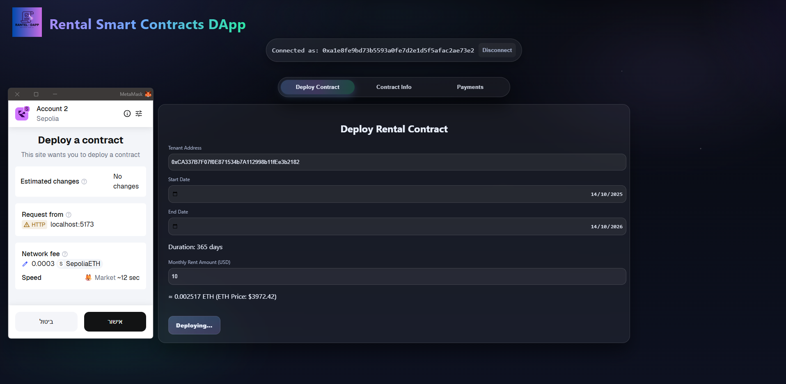

### Contract Info
Display contract metadata:
- Landlord & tenant
- Rent amount (ETH/USD)
- Start & end date
- Status (Created / Signed / Locked / Cancelled / Terminated)
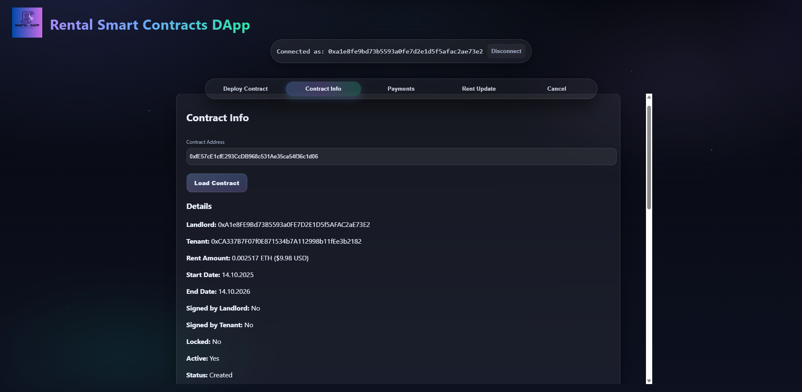

### Sign Contract
- Detects connected wallet role (landlord/tenant)
- Calls the correct signing function automatically
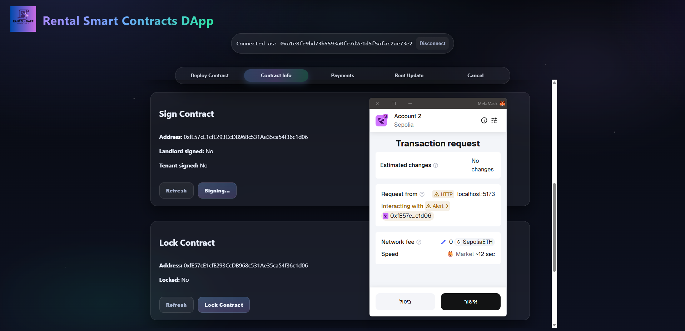

### Lock Contract - Landlord Only
- Available only to landlord
- Locks contract after both parties have signed
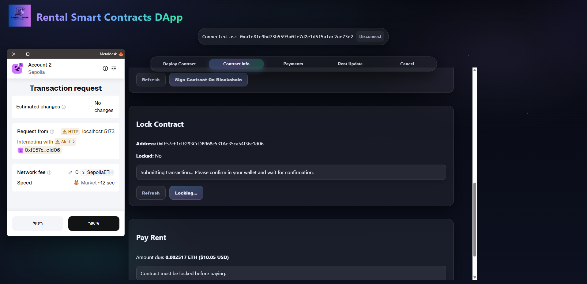

### Pay Rent - Tenant Only
- Tenant can pay monthly rent in ETH
- Tracks payment status on-chain
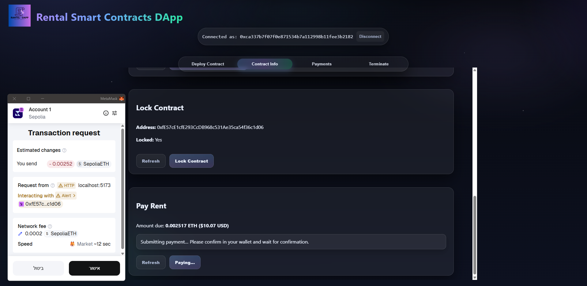

### Payments History
- Shows all past transactions & rent payments from events
- Export to PDF

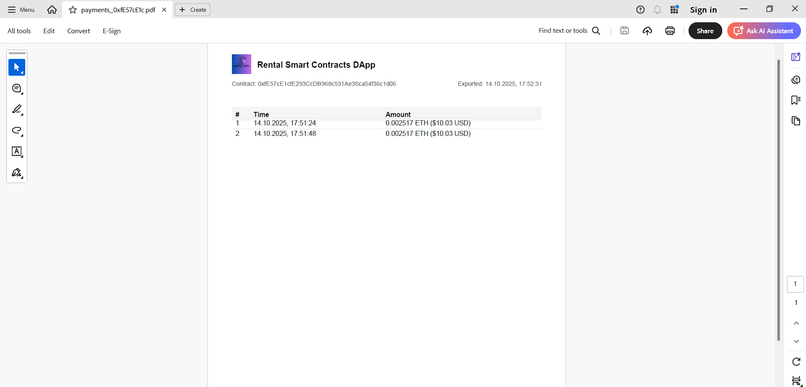

### Update Rent - Landlord Only
- Landlord can modify monthly rent amount in USD (auto converts to ETH), before the contract is locked
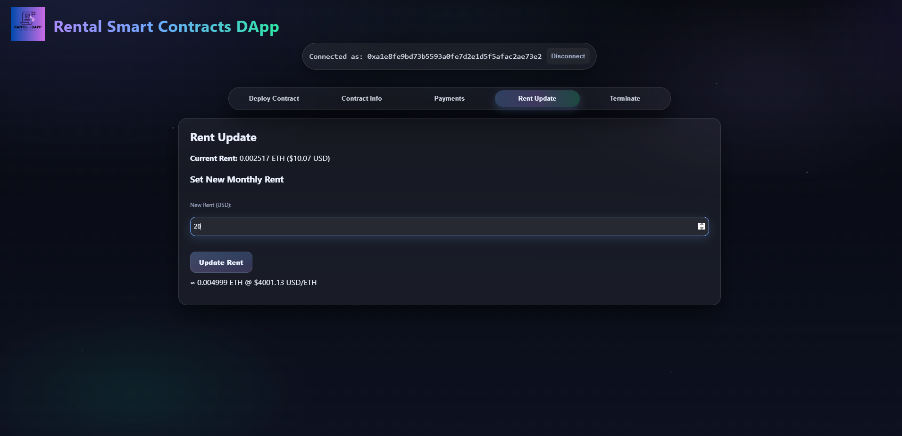

### Cancel Contract - Before Lock
- The landlord and the tenant can cancel the contract before locking it
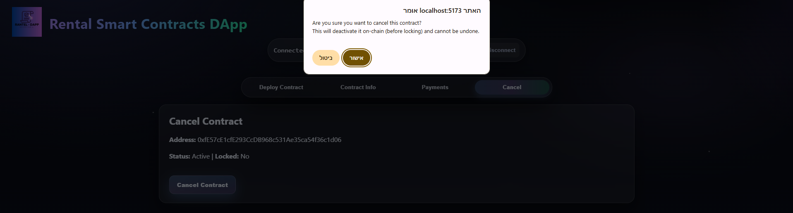

### Terminate Contract - After Lock, Tenant Only
- Tenant can terminate early (with a 2× rent fee)
- Shows dynamic termination fee
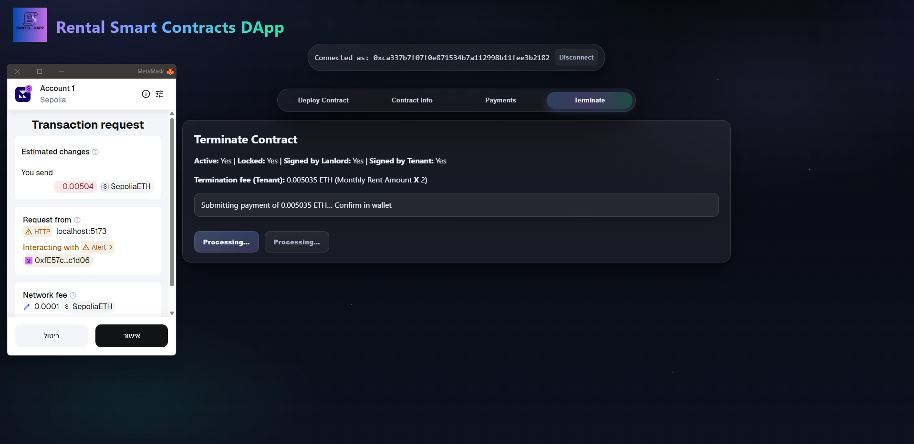
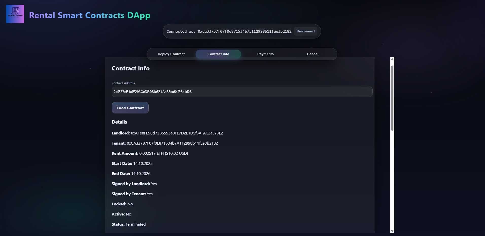

### Transactions on Etherscan
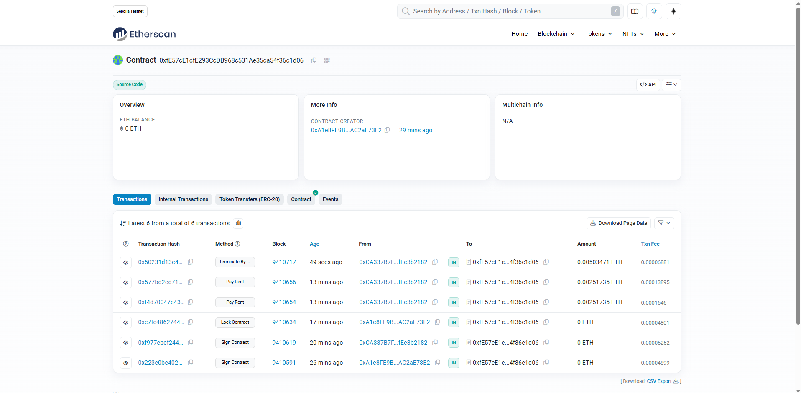

---

## 🏗️ Architecture Overview

This project follows a **modular full-stack architecture**:

- **Frontend (React + Ethers.js)**  
  Handles wallet connection, user interaction, and blockchain transactions.  
  Communicates with the backend using REST endpoints for authentication and data persistence.

- **Backend (Node.js + Express)**  
  Manages authentication (SIWE + JWT), user sessions, and nonces.  
  Serves as a secure bridge between the blockchain and MongoDB.

- **Database (MongoDB Atlas)**  
  Stores user sessions, addresses, and nonces.  
  Ensures one wallet = one user = one rotating nonce.

- **Blockchain Layer (Ethereum / Sepolia)**  
  All rental agreements are deployed and executed on-chain.  
  The smart contracts live in the [Rental-Smart-Contracts](https://github.com/TomerBitonn/Rental-Smart-Contracts.git) repository.

---

## 🔄 System Overview


## 🔐 Authentication Flow Diagram
```mermaid
flowchart LR
  A[User clicks Login]
  A --> B[/auth/nonce → Backend/]
  B --> C[User signs message]
  C --> D[/auth/verify → Backend/]
  D --> E[JWT cookie created]
  E --> F[/me → Authenticated DApp/]
```

---

## 🛠️ Tech Stack

| Layer          | Tools                                           |
|----------------|-------------------------------------------------|                                                    
| **Frontend**   | React, Vite, Ethers.js, SIWE.js, MetaMask       |
| **Backend**    | Node.js, Express.js, MongoDB, JWT, CORS, dotenv |
| **Database**   | MongoDB Atlas                                   |
| **Blockchain** | Ethereum (Sepolia Testnet)                      |
| **APIs**       | CoinGecko API (ETH/USD pricing)                 |

---

## 📂 Project Structure

```
RENTAL-DAPP-DEV/
│
├── frontend/
│   ├── assets/                        
│   ├── node_modules/
│   ├── src/
│   │   ├── abi/
│   │   │   └── RentalContract.json     
│   │   │
│   │   ├── components/
│   │   │   ├── CancelContract.jsx      
│   │   │   ├── ContractInfo.jsx        
│   │   │   ├── DeployContract.jsx      
│   │   │   ├── LockContract.jsx        
│   │   │   ├── Login.jsx               
│   │   │   ├── PaymentsHistory.jsx     
│   │   │   ├── PayRent.jsx             
│   │   │   ├── RentUpdate.jsx         
│   │   │   ├── SignContract.jsx        
│   │   │   └── TerminatedContract.jsx  
│   │   │
│   │   ├── styles/
│   │   │   ├── App.css
│   │   │   ├── Components.css
│   │   │   └── index.css
│   │   │
│   │   ├── api.js                      
│   │   ├── App.jsx                    
│   │   └── main.jsx                    
│   │
│   ├── .gitignore
│   ├── eslint.config.js
│   ├── index.html
│   ├── package.json
│   ├── package-lock.json
│   └── vite.config.js                  
│
├── server/
│   ├── node_modules/
│   ├── .env                            
│   ├── .gitignore
│   ├── auth.js                        
│   ├── db.js                          
│   ├── package.json
│   ├── package-lock.json
│   └── server.js                      
│
└── README.md
```

---

## 🔐 Security Practices

- JWT tokens are stored in **HttpOnly cookies** (not accessible via JS).  
- Nonce values are rotated after each successful SIWE verification.  
- MongoDB enforces a **unique index** on wallet addresses.  
- CORS restricted to `FRONTEND_ORIGIN` for API protection.  
- No private keys or sensitive wallet data are stored on the backend.

---

## ⚙️ Environment Variables

Your `.env` file (in `/server`) should include:
```bash
PORT=3001
DOMAIN=localhost
FRONTEND_ORIGIN=http://localhost:5173
MONGODB_URI=mongodb+srv://<your-cluster-url>/
JWT_SECRET=your_secret_key
NODE_ENV=development
```

## 🧩 Installation & Run

1. Clone this repo:
   ```bash
   git clone https://github.com/TomerBitonn/Rental-dApp.git
   cd Rental-dApp
   ```

2. Install dependencies:
   ```bash
   cd frontend && npm install
   cd ../server && npm install
   ```

3. Run backend:
   ```bash
   node server.js
   ```

4. Run frontend:
   ```bash
   cd ../frontend
   npm run dev
   ```

5. Open in browser:
   ```bash
   http://localhost:5173
   ```

---

## 🧠 Troubleshooting

- **Error: "Domain does not match provided domain"**  
  → Ensure `.env` → `DOMAIN` matches your frontend URL (e.g. `localhost:5173`).

- **Error: "Invalid nonce"**  
  → Clear browser cookies or restart the backend server to reset sessions.

- **MongoDB connection issues**  
  → Check that your IP is whitelisted in MongoDB Atlas.

- **Metamask not detected**  
  → Make sure the extension is installed and you’re connected to Sepolia.
